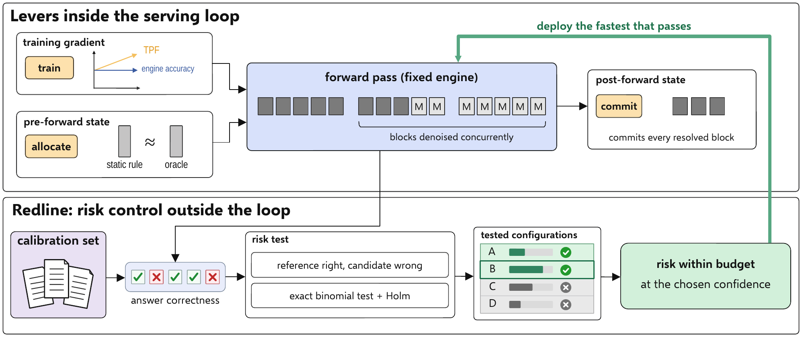
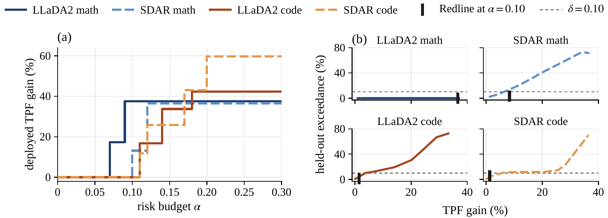

<p align="center">
  
</p>

<div align="center">

# Redline

### Deploy the fastest serving configuration within a risk budget

<em>Faster Block-Diffusion Serving with Distribution-Free Risk Guarantees</em>

[](LICENSE)
[](https://creativecommons.org/licenses/by/4.0/)
[](https://www.python.org/)
[](https://github.com/js-lee-AI/Redline/actions/workflows/ci.yml)
[](https://github.com/js-lee-AI/Redline/stargazers)

<b><a href="#quick-start">Quick start</a> · <a href="#usage">Usage</a> · <a href="#command-line">CLI</a> · <a href="#results">Results</a> · <a href="#reproduce-the-paper">Reproduce</a> · <a href="#faq">FAQ</a> · <a href="#citation">Citation</a></b>

</div>

---

## News

- **[2026-09-28]** Code released, together with the prompt-level outcomes of every grid in the paper and the scripts that rebuild its tables and figures from them on a CPU.

## Overview

Block-diffusion language models are served at hand-picked operating points, such as acceptance thresholds, buffer depth, schedule, checkpoint and precision, and each point is chosen by its mean benchmark accuracy. A mean does not tell an operator how often a faster configuration fails on prompts that the slower one answers correctly, because the prompts it newly gets right offset those it newly gets wrong.

Redline selects the operating point from the correctness of answers on calibration prompts instead. It rests on three ideas.

* **Risk is measured against a reference.** The reference-relative risk of a configuration is the probability that the reference answers a prompt correctly and the configuration does not, so a fix on one prompt cannot hide a regression on another.
* **Every configuration is tested at once.** An exact binomial p-value for each configuration and Holm's step-down procedure keep the family-wise error at δ under any dependence between configurations that share prompts.
* **The fastest valid configuration is deployed.** Its risk stays within the budget α with probability at least 1 − δ, in finite samples and without distributional assumptions. At a budget of 0.10, Redline deploys a LLaDA2 math configuration at +37.5% tokens per forward (TPF) over the engine default (paper Table 2).

```
R(λ) = Pr[ reference correct and λ incorrect ]        Pr[ R(λ*) ≤ α ] ≥ 1 − δ
```

Nothing in Redline inspects diffusion internals. It needs a reference configuration, a grid of lossy settings, correctness outcomes and a cost measure, so the same code also selects the acceptance rule of speculative decoding and the precision of quantized weights.

This repository is Redline as a small library, plus the prompt-level outcomes and the scripts that reproduce the paper.

## What it does in one picture

<p align="center">
  
</p>

<p align="center"><em>Levers inside the serving loop and risk control outside it. The paper measures the three levers at the top, and this repository is the bottom half, which tests every configuration on the correctness of its answers, keeps those that pass and deploys the fastest (paper Figure 1).</em></p>

## Quick start

```bash
pip install "git+https://github.com/js-lee-AI/Redline.git"
```

```python
import numpy as np
import redline

rng = np.random.default_rng(0)
ref = rng.random(1000) < 0.8                    # the reference answers 80% of 1,000 prompts
risk = np.array([0.03, 0.05, 0.07, 0.13])       # true P(reference right, config wrong)
fix = np.array([0.05, 0.05, 0.10, 0.50])        # share of reference misses each config gets right
u = rng.random((4, 1000))
faster = np.where(ref, u >= risk[:, None] / 0.8, u < fix[:, None])
correct = np.vstack([ref, faster])              # one row of 0/1 answers per configuration
tpf = [4.0, 4.6, 5.2, 5.8, 6.4]                 # tokens per forward, reference first

print(redline.select(correct, tpf, reference=0, alpha=0.10, names=["default", "A", "B", "C", "D"]))
# alpha=0.10  delta=0.10  n=1000  m=5
# config          cost    acc   risk  p-value  valid
# default (ref)   4.00  0.788  0.000  1.7e-46  yes
# A               4.60  0.759  0.041  2.8e-12  yes
# B               5.20  0.753  0.045  1.1e-10  yes
# C               5.80  0.738  0.070  5.7e-04  yes  <- deployed
# D               6.40  0.750  0.134  1.0e+00  no
# deploy C, +45.0% over the reference
```

This runs on a CPU in well under a second and downloads nothing. The same code is [`examples/quickstart.py`](examples/quickstart.py), and CI runs it on every push. Configuration D is the fastest and even more accurate than C on average, yet it turns too many of the reference's correct answers into wrong ones to pass at a budget of 10%, which a mean accuracy would not show.

| install | adds | enough for |
|---|---|---|
| `pip install "git+https://github.com/js-lee-AI/Redline.git"` | numpy, scipy | the API, the quickstart, the `redline` command on your own outcome file |
| `pip install "redline-serving[plot] @ git+https://github.com/js-lee-AI/Redline.git"` | matplotlib | the `--plot` option of two experiment scripts |
| `git clone` and then `pip install -e ".[test]"` | pytest | `experiments/`, `data/` and `tests/` |

Tested with Python 3.11.5 under numpy 1.26.4 with scipy 1.11.1 and under numpy 2.4.6 with scipy 1.17.1, which print identical output for every script. CI runs the tests on Python 3.10 and 3.13.

## Usage

### Select a configuration from your own outcomes

Serve each configuration of your grid on the same calibration prompts and write one row per configuration and prompt, with the columns `config`, `prompt`, `correct`, `tokens` and `forwards` ([format](data/README.md)).

```python
import redline

grid = redline.load_outcomes("outcomes.csv", reference="acc95/semi90")
result = redline.select(grid.correct, grid.cost(), reference=grid.ref,
                        alpha=0.10, delta=0.10, names=grid.configs)
print(result.deployed_name, result.gain)   # the configuration to serve, and its TPF gain in %
print(result.valid)                        # which configurations passed
```

`alpha` is the risk budget and `delta` the failure probability. The cost only chooses among the configurations that pass, so the guarantee covers the risk and not the speed (paper Section 4.1). For quantization, pass the weight memory as the cost with `lower_is_better=True`.

### Plan the calibration set

```python
import redline

# prompts from which a configuration two points under alpha = 0.05 passes with power 0.8,
# at Holm's first step on a grid of eight configurations
redline.prompts_needed(alpha=0.05, risk=0.03, level=0.10 / 8)   # 1008
```

### API at a glance

| call | what it does | needs |
|---|---|---|
| `redline.select(correct, cost, reference, alpha, delta)` | tests every configuration and deploys the fastest valid one | base install |
| `redline.load_outcomes(path, reference, cost="tpf")` | reads an outcome file into a grid | base install |
| `redline.pvalues(k, n, alpha)` | exact binomial p-value for a risk above alpha, from k violations in n prompts | base install |
| `redline.holm(p, delta)` | Holm's step-down procedure, returns which configurations are valid | base install |
| `redline.prompts_needed(alpha, risk, level)` | calibration size for a target power | base install |
| `redline.load_grid(name)` | one of the paper's grids from `data/` | a clone |

The package needs only numpy and scipy.

## Command line

Installing the package adds a `redline` command, and `python -m redline` runs the same thing.

```bash
redline --help
redline demo                                                     # the quickstart, on CPU
redline select outcomes.csv --reference acc95/semi90 --alpha 0.10 --json result.json
redline sample-size --alpha 0.05 --risk 0.03 --m 8               # calibration prompts needed
```

In a clone, `redline select data/outcomes/llada2_math.csv --reference acc95/semi90` runs the three-dimensional LLaDA2 math grid of Appendix D.7 and deploys acc85/semi70 at +37.5% TPF.

## Results

In both model families, math gains speed at a smaller risk budget than code, and at a budget of ten percent Redline deploys a LLaDA2 math configuration that commits over a third more tokens in each forward.

<p align="center">
  
</p>

<p align="center"><em>(a) Deployed TPF gain across risk budgets. (b) Held-out exceedance, the rate at which the deployed configuration exceeds the budget on held-out halves, against TPF gain at α = 0.10, for the mean-accuracy rule across its tolerances and for Redline (paper Figure 3).</em></p>

### Configurations that Redline deploys at three risk budgets (paper Table 2)

δ = 0.10 with Holm. The gain is over the reference in the cost measure of each group, and Δacc. is the net accuracy change in points. Below α<sub>min</sub>, the smallest budget at which a cheaper configuration passes, the reference is deployed.

| grid | n | m | α<sub>min</sub> | α = 0.10 gain | Δacc. | α = 0.15 gain | Δacc. | α = 0.20 gain | Δacc. |
|---|---|---|---|---|---|---|---|---|---|
| *Block-diffusion serving, TPF gain (%)* | | | | | | | | | |
| LLaDA2 math | 1,012 | 7 | 0.07 | +37.5 | −4.0 | +37.5 | −4.0 | +37.5 | −4.0 |
| LLaDA2 math, large grid | 1,012 | 50 | 0.07 | +65.4 | −3.4 | +72.0 | −5.9 | +72.0 | −5.9 |
| LLaDA2 code | 542 | 8 | 0.11 | 0.0 | 0.0 | +33.7 | −7.0 | +42.4 | −13.1 |
| SDAR math | 1,012 | 8 | 0.10 | +13.1 | −2.5 | +36.6 | −4.6 | +36.6 | −4.6 |
| SDAR code | 664 | 8 | 0.11 | 0.0 | 0.0 | +25.7 | −5.0 | +59.7 | −14.0 |
| *Speculative decoding on GSM8K, gain in accepted tokens for each target forward (%)* | | | | | | | | | |
| Llama | 512 | 7 | 0.09 | +13.8 | −3.3 | +16.8 | −9.0 | +16.8 | −9.0 |
| Qwen | 512 | 7 | 0.04 | +18.1 | −1.6 | +18.1 | −1.6 | +18.1 | −1.6 |
| *Weight quantization on GSM8K, reduction in weight memory* | | | | | | | | | |
| Llama | 512 | 4 | 0.07 | 2.81× | −1.4 | 2.81× | −1.4 | 2.81× | −1.4 |

The deployed math configurations at α = 0.10 are acc85/semi70 on LLaDA2 and acc90/semi90 on SDAR, with 95% paired-bootstrap intervals of 34.0 to 41.1% and 7.1 to 19.6% on their TPF gains (paper Table 5). The risk bounds only the answers a configuration newly gets wrong, so Δacc. is printed beside every gain, and some faster configurations even gain net accuracy. The references are the engine default acc95/semi90, lossless verification and bf16 weights. Reproduce this table with `python experiments/table2_deployments.py`.

### Against the mean-accuracy rule (paper Figure 3b and Section 5.3)

A mean lets the prompts that a configuration fixes offset those it fails. The SDAR math configuration deployed at α = 0.10 turns a correct reference answer into a wrong one on 7.1% of prompts, nearly three times its net accuracy drop. Over 1,000 random half splits, each rule runs on one half and its deployed configuration is scored on the other. At α = 0.10, every tolerance of the mean-accuracy rule up to four points gains less TPF than Redline on LLaDA2 math, and every tolerance from five points up exceeds the budget in over 70% of held-out splits on SDAR math, against 3.4% for Redline.

### Validity out of sample (paper Figure 4 and Table 16)

Across 12 grids and 220 combinations of grid, risk budget and calibration size, each on 1,000 random calibration and test splits, the minimum coverage is 0.904, the maximum family-wise error rate is 0.096, and no combination exceeds the nominal level. Re-measured on held-out halves, the deployed configurations stay close to their in-sample gains, +37.6% against +37.5% TPF for LLaDA2 math at α = 0.10 and +13.4% against +13.1% for SDAR math.

### A grid of 50 configurations (paper Table 17)

The LLaDA2 math grid of 50 configurations over the engine's three lossy thresholds, tested as three nested grids of the same served outputs (n = 1,012, δ = 0.10).

| α | deployed | valid | k | R̂ | TPF | TPF gain (%) | net accuracy (pp) |
|---|---|---|---|---|---|---|---|
| *The six configurations shared with the main grid, m = 6* | | | | | | | |
| 0.05 | reference | 1 of 6 | 0 | 0.000 | 4.42 | +0.0 | +0.0 |
| 0.10 | acc85/semi70/add0.10 | 6 of 6 | 53 | 0.052 | 5.90 | +33.4 | −1.5 |
| 0.15 | acc85/semi70/add0.10 | 6 of 6 | 53 | 0.052 | 5.90 | +33.4 | −1.5 |
| 0.20 | acc85/semi70/add0.10 | 6 of 6 | 53 | 0.052 | 5.90 | +33.4 | −1.5 |
| *The add 0.10 slice, m = 25* | | | | | | | |
| 0.05 | reference | 1 of 25 | 0 | 0.000 | 4.42 | +0.0 | +0.0 |
| 0.10 | acc80/semi50/add0.10 | 19 of 25 | 79 | 0.078 | 6.84 | +54.7 | −4.0 |
| 0.15 | acc75/semi50/add0.10 | 25 of 25 | 99 | 0.098 | 7.60 | +72.0 | −5.9 |
| 0.20 | acc75/semi50/add0.10 | 25 of 25 | 99 | 0.098 | 7.60 | +72.0 | −5.9 |
| *The whole grid, m = 50* | | | | | | | |
| 0.05 | reference | 1 of 50 | 0 | 0.000 | 4.42 | +0.0 | +0.0 |
| 0.10 | acc75/semi80/add0.30 | 36 of 50 | 74 | 0.073 | 7.31 | +65.4 | −3.4 |
| 0.15 | acc75/semi50/add0.10 | 50 of 50 | 99 | 0.098 | 7.60 | +72.0 | −5.9 |
| 0.20 | acc75/semi50/add0.10 | 50 of 50 | 99 | 0.098 | 7.60 | +72.0 | −5.9 |

Every configuration of this grid was served anew, so each gain is relative to its own reference, acc95/semi90/add0.10. A grid seven times larger costs at most 3.0 points of gain at the printed budgets and reaches configurations the small grid does not contain. Reproduce this table with `python experiments/table17_large_grid.py`.

## Reproduce the paper

```bash
git clone https://github.com/js-lee-AI/Redline.git
cd Redline
pip install -e ".[test,plot]"
mkdir -p results
```

Every deployment and guarantee in the paper is a deterministic function of prompt-level correctness and cost counts, and [`data/`](data/README.md) ships them for every grid. Each row is one prompt served under one configuration.

```
config,prompt,correct,tokens,forwards
acc85/semi70,gsm8k/0,1,184,35
```

| paper | command | hardware | time |
|---|---|---|---|
| Table 2 | `python experiments/table2_deployments.py` | CPU | about 1 s |
| Figure 3a | `python experiments/figure3a_frontier.py --plot results/figure3a.png` | CPU | about 1 s |
| Figure 3b (Redline) and Table 16 | `python experiments/table16_heldout.py` | CPU | about 2 s |
| Table 4 | `python experiments/full_grid.py sdar_math500_distilled` | CPU | under 1 s |
| Table 5 | `python experiments/table5_intervals.py` | CPU | about 4 s |
| Table 6 | `python experiments/table6_subsample.py` | CPU | about 3 s |
| Table 7 | `python experiments/table7_sample_size.py` | CPU | about 3 s |
| Tables 8 to 11 | `python experiments/full_grid.py llada2_math`, then `llada2_code`, `sdar_math`, `sdar_code` | CPU | under 1 s each |
| Tables 12 and 13 | `python experiments/full_grid.py llada2_math_small`, then `llada2_code_small` | CPU | under 1 s each |
| Table 17 | `python experiments/table17_large_grid.py` | CPU | under 1 s |
| Figure 4 and Appendix A.7 | `python experiments/figure4_validity.py --out results/figure4.json` | CPU | about 15 s |
| Figure 5 | `python experiments/figure5_grid_size.py --plot results/figure5.png` | CPU | about 1 s |
| Appendix A.7, synthetic check | `python experiments/synthetic_check.py` | CPU | under 1 s |
| Appendix D.3, sensitivity to δ | `python experiments/figure3a_frontier.py --deltas 0.10,0.05,0.01` | CPU | about 1 s |
| Appendix D.7 | `python experiments/full_grid.py llada2_math_3d` | CPU | under 1 s |
| Appendix D.11, held out | `python experiments/table16_heldout.py --grids llada2_math_large` | CPU | about 1 s |
| Appendix E | `python experiments/full_grid.py specdec_llama_gsm8k_all`, then `specdec_qwen_gsm8k_all`, `quant_llama_gsm8k` | CPU | under 1 s each |

Every script prints the rows it reproduces, and all of them use δ = 0.10 by default. The scripts that resample prompts (Tables 5, 6 and 16, Figures 4 and 5) use fixed seeds, so they print the paper's values exactly. All grid runs decode greedily, so no sampling seed is involved.

### Serving the block-diffusion grids

[`serving/block_diffusion/`](serving/block_diffusion) holds what produced the block-diffusion outcome files, with the multi-block engine [Diffulex](https://github.com/SJTU-DENG-Lab/Diffulex) at commit `9d1a04e` and the public checkpoints of [Multi-Block Diffusion Language Models](https://arxiv.org/abs/2606.29215).

```bash
python serving/block_diffusion/make_configs.py --out_dir configs
ENGINE_DIR=/path/to/Diffulex MODEL_PATH=/path/to/checkpoint \
    bash serving/block_diffusion/run_grid.sh configs/sdar_math.yml runs/sdar_math
python serving/block_diffusion/export_outcomes.py --runs runs/sdar_math --out sdar_math.csv
```

| outcome file | config | checkpoint | prompts per subtask | batch |
|---|---|---|---|---|
| `llada2_math.csv` | `llada2_math.yml` and `llada2_math_add.yml` | [MBD-Math-LLaDA2-mini-16B](https://huggingface.co/SJTU-DENG-Lab/MBD-Math-LLaDA2-mini-16B) | 512 | 8 |
| `llada2_math_large.csv` | `llada2_math_large.yml` | [MBD-Math-LLaDA2-mini-16B](https://huggingface.co/SJTU-DENG-Lab/MBD-Math-LLaDA2-mini-16B) | 512 | 8 |
| `llada2_code.csv` | `llada2_code.yml` | [MBD-Code-LLaDA2-mini-16B](https://huggingface.co/SJTU-DENG-Lab/MBD-Code-LLaDA2-mini-16B) | 512 | 16 |
| `llada2_math_small.csv` | `llada2_math_small.yml` | [MBD-Math-LLaDA2-mini-16B](https://huggingface.co/SJTU-DENG-Lab/MBD-Math-LLaDA2-mini-16B) | 256 | 16 |
| `llada2_math_tiny.csv` | `llada2_math_small.yml` | [MBD-Math-LLaDA2-mini-16B](https://huggingface.co/SJTU-DENG-Lab/MBD-Math-LLaDA2-mini-16B) | 32 | 8 |
| `llada2_code_small.csv` | `llada2_code.yml` | [MBD-Code-LLaDA2-mini-16B](https://huggingface.co/SJTU-DENG-Lab/MBD-Code-LLaDA2-mini-16B) | 256 | 8 |
| `sdar_math.csv` | `sdar_math.yml` | [MBD-Math-SDAR-8B-Chat-b32](https://huggingface.co/SJTU-DENG-Lab/MBD-Math-SDAR-8B-Chat-b32) | 512 | 8 |
| `sdar_code.csv` | `sdar_code.yml` | [MBD-Code-SDAR-8B-Chat-b32](https://huggingface.co/SJTU-DENG-Lab/MBD-Code-SDAR-8B-Chat-b32) | 512 | 8 |

The third and fourth arguments of `run_grid.sh` set the prompts per subtask and the batch. Pass several run folders to `export_outcomes.py` to merge them into one file, as for the two LLaDA2 math configs. The upstream SDAR sampler fixes its accept threshold at 0.95, so apply `sdar_accept_threshold.patch` in the engine checkout (`patch -p1 < sdar_accept_threshold.patch`) before serving the SDAR grids. Give each run a GPU of its own, since another process on the same card changes the KV-cache pool and with it the batching. The distilled SDAR checkpoint of Table 4 is not released, and its outcomes ship in `sdar_math.csv` under the `distilled/` prefix. The speculative-decoding and quantization outcome files ship as measured.

## Repository layout

```
redline/core.py            p-values, Holm, deployment and select()
redline/grids.py           outcome files and the grids of the paper
redline/power.py           calibration size for the exact binomial test
redline/cli.py             the redline command
examples/quickstart.py     the CPU demo shown above
experiments/               one script per paper table or figure
data/                      prompt-level outcomes of every grid, and grids.json
serving/block_diffusion/   engine configs, run script, outcome export and the SDAR patch
tests/                     fast CPU tests that CI runs
```

## FAQ

<details>
<summary><b>Do I need a GPU?</b></summary>

No. Redline reads correctness outcomes and one cost per configuration, so the library, the quickstart and every script in `experiments/` run on a CPU from the files in `data/`. Only serving a grid anew needs GPUs, one for each configuration run, and the Diffulex engine.

</details>

<details>
<summary><b>What exactly is guaranteed?</b></summary>

The reference-relative risk of the deployed configuration is at most α with probability at least 1 − δ, provided the calibration prompts are drawn i.i.d. from the deployment distribution (paper Section 4 and Appendix A). The guarantee is relative to that distribution and to the reference, so a deployment that serves a different prompt distribution or batching policy re-calibrates first. Speed is not part of it. TPF only chooses among the valid configurations, and the TPF reported is that of the deployed configuration. Because each outcome is the realized correctness of a served output, the risk also covers the run-to-run variation of the engine.

</details>

<details>
<summary><b>Why not deploy the fastest configuration within a few points of the reference's accuracy?</b></summary>

Because a mean lets the prompts that a configuration fixes offset those it fails. At α = 0.10 no single tolerance of that rule is both as fast as Redline on LLaDA2 math and as rarely over the budget on SDAR math, and a tolerance chosen separately for each grid could be checked against the budget only by measuring the risk on that grid, which a mean does not report (paper Section 5.3).

</details>

<details>
<summary><b>How many calibration prompts do I need?</b></summary>

It depends on how close to the budget a configuration sits. With eight configurations, one that sits two points under a budget of α = 0.05 passes with probability at least 0.8 from about 1,000 prompts (paper Table 7 gives 1,008). `redline sample-size` computes this for your own budget, true risk and grid size.

</details>

<details>
<summary><b>How is this different from Learn-Then-Test or CALM?</b></summary>

Redline instantiates [Learn-Then-Test](https://doi.org/10.1214/24-AOAS1998) for serving, with the reference-relative joint risk in place of a marginal error rate. [CALM](https://arxiv.org/abs/2207.07061), the closest prior use in decoding, calibrates one early-exit threshold against the full model by a fixed-sequence walk. Redline selects from a searched grid of serving configurations whose risk is non-monotone in the thresholds, which Holm handles without an order, and it applies unchanged to any cost measure.

</details>

## Citation

If you use this code, please cite the paper.

```bibtex
@article{lee2026redline,
  title   = {Faster Block-Diffusion Serving with Distribution-Free Risk Guarantees},
  author  = {Lee, Jungseob and Lee, Dongyub Jude and Park, Chanjun and Eo, Sugyeong and Lim, Heuiseok},
  year    = {2026}
}
```

The arXiv identifier is added here once it is assigned. The Cite this repository button in the GitHub sidebar gives the same entry from [`CITATION.cff`](CITATION.cff).

## License

Code is MIT, see [LICENSE](LICENSE). The paper is CC BY 4.0.

## Acknowledgments

Redline builds on [Learn-Then-Test](https://doi.org/10.1214/24-AOAS1998) and on the step-down procedure of Holm (1979). The block-diffusion grids were served with the [Diffulex](https://github.com/SJTU-DENG-Lab/Diffulex) engine and the public MBD-LM checkpoints of [Jin et al. (2026)](https://arxiv.org/abs/2606.29215).
